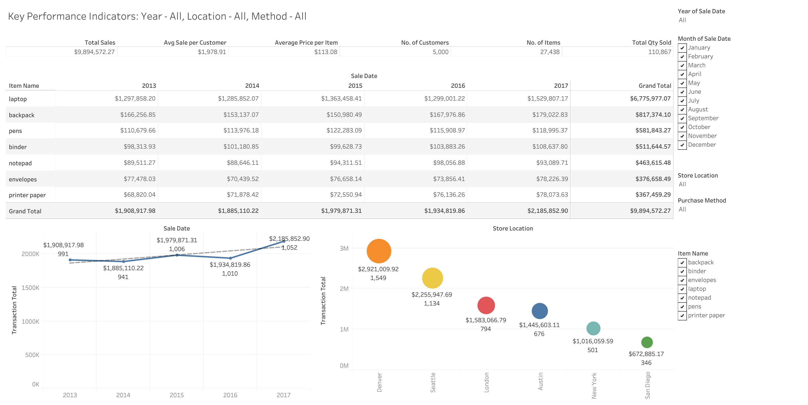

# Project Overview

In this project, I utilized a sample JSON sales dataset obtained from Kaggle: [Sales JSON Dataset](https://www.kaggle.com/datasets/shrashtisinghal/mongo-db-datsets?select=sales.json). The data was imported into MongoDB for further analysis. The key steps involved in this project include:

- Querying the MongoDB database to calculate key performance indicators (KPIs). This step was essential for validating the accuracy of the data imported into Tableau for visualization.
- Exporting the sales document from MongoDB in JSON format.
- Converting the JSON file to CSV format for compatibility with Tableau.
- Importing the CSV file into Tableau to create a comprehensive dashboard.

You can view and interact with the Tableau dashboard [here](https://public.tableau.com/app/profile/rofiatu/viz/sales_data_17201175666190/Dashboard).



# Project Steps

## Step 1: Download JSON Data
- Obtain the dataset from Kaggle.

## Step 2: Set Up MongoDB
- Install Mongo Shell: Follow the instructions here: [Mongo Shell Installation](https://www.mongodb.com/docs/mongodb-shell/?_ga=2.140576567.482983825.1721394646-627325655.1720002336).
- Create Database and Collection:
  1. Open Mongo Shell.
  2. Create and switch to your database:

    ```shell
    use mydatabase
    ```

    Replace `mydatabase` with your desired database name. This command creates and accesses the database if it doesn't already exist.

  3. Import your JSON file into the database:

    ```shell
    mongoimport --db mydatabase --collection mycollection --file data.json
    ```

    Replace `mydatabase` and `mycollection` with your database and collection names. A collection is created when data is first inserted.

## Step 3: Database Operations in Code Editor
- Setup VSCode: If not installed, download here: [VSCode Download](https://code.visualstudio.com/download).
- Setup and navigate to project directory:

    ```shell
    mkdir myproject  # This creates the directory
    cd myproject  # This navigates to the directory
    ```

- Create virtual environment:

    ```shell
    python3 -m venv myenv  # Replace myenv with your desired virtual environment name
    ```

- Activate your virtual environment:

    ```shell
    source myenv/bin/activate
    ```

- Install requisite libraries from requirements file:

    ```shell
    pip install -r requirements.txt
    ```

- Connect to Database: Follow instructions in the `db_operations` file.
- Calculate KPIs: Refer to the `kpi_calculations` file.
- Convert JSON to CSV: Use the `json_to_csv` file to transform BSON data for use in Tableau.

## Step 4: Import CSV to Tableau
- Import the CSV file into Tableau for data visualization.

## Challenges and Solutions

**Challenge**: Working with a JSON file in Tableau as a beginner in data analysis.
- **Initial Approach**: Directly importing the JSON file into Tableau resulted in incorrect data mapping due to the flattening process.
- **Solution**: Flatten the database data into a CSV file before importing it into Tableau. This ensured accurate data representation.

## Validating Tableau Data

To validate the data in Tableau:
- **Comparison with KPIs**: Validate the Tableau data by comparing it with pre-calculated KPIs from the database.
- **Alternative Method**: Pick IDs from visible rows in Tableau and query the same IDs in the database to compare results.

This streamlined process ensures the accuracy and integrity of your data analysis workflow.

